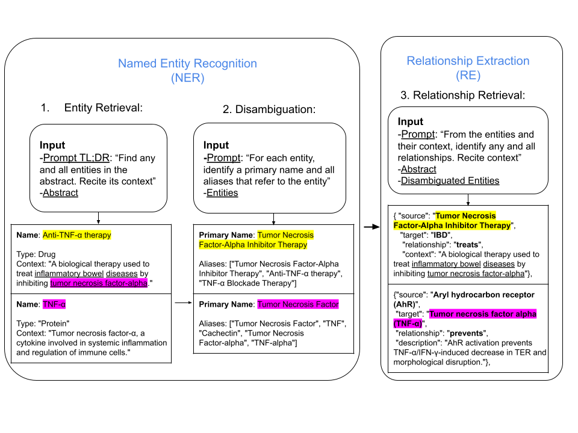
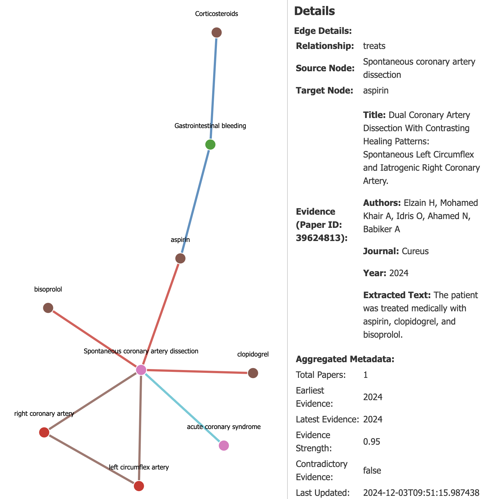
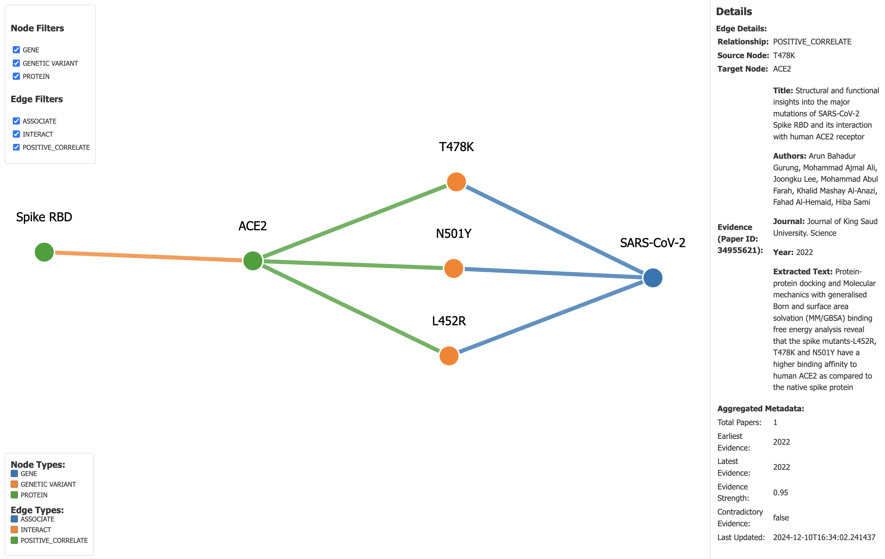

# README BIO-NEXUS
## Overview
This is BIO-NEXUS, a biomedical knowledge graph tool for extracting, processing, and visualizing relationships between biomedical entities from scientific literature. It combines LLMs (e.g., Llama models offered by Cerebras API) with domain-specific tools such as PubTator to analyze abstracts, extract entities (e.g., genes, diseases) and relationships (e.g., cause, treat), and populate a dynamic knowledge graph.

### Pipeline
#### 1. Automated Data Collection: 
The system retrieves biomedical abstracts from PubMed based on user-defined date ranges and stores parsed metadata in JSON format.
#### 2. Entity Retrieval: 
Biomedical concepts and terms within an abstract are identified and cited with the relevant sentences. A secondary LLM call refines the specificity of these entities.
#### 3. Disambiguation: 
From exact matching to fuzzy matching with string similarity to LLM disambiguation, the system identifies canonical names and potential aliases for entities.
#### 4. Relationship Extraction: 
The LLM identifies predefined relationships between entities given the cited context, entity types, and abstract. Context-aware extraction ensures relationships are grounded in the cited evidence, supplemented by confidence scoring.
#### 5. Deduplication (not shown): 
Entities and relationships are normalized into a graph format using rule-based or LLM-based approaches, merging highly similar entities or relationships into single nodes or edges, respectively.
#### Visualized


### Project Structure
```
project/
├─ src/
│  ├─ models/
│  │  ├─ cerebras_inference.py      # LLM inference backend (Cerebras)
│  ├─ pubtator.py                   # PubTator integration for entity normalization
│  ├─ knowledge_graph_updater.py    # Updates and maintains the knowledge graph
│  ├─ scraper.py                    # Fetches and prepares PubMed abstracts
├─ data/
├─ logs/
├─ main.py
├─ index.html                       # Visualization interface
├─ script.js                        # Graph visualization logic
├─ style.css                        
├─ README.md
├─ requirements.txt
```

## Setup Instructions
### Clone the Repository
```
git clone 'repository-url'
cd bio-nexus
```
### Virtual Environment and Dependencies
Set up a virtual environment and install dependencies in requirements.txt
```
python3 -m venv .venv
source .venv/bin/activate
pip install -r requirements.txt
```
### Environment Variables
Here, we used Cerebras API for Inference. The Cerebras Cloud Python SDK can be access [here](https://github.com/Cerebras/cerebras-cloud-sdk-python).
```
export CEREBRAS_API_KEY='api_key'
```
We also use Entrez to fetch PubMed articles.
```
export ENTREZ_EMAIL='email'
export ENTREZ_API_KEY='api_key'
```

## Pipeline
### Run Command
You can run this script (or something specific to your machine, specific to how the data is set up):
```
python main.py --graph_path ./data/knowledge_graph.json --data_path ./data/data.json --model_name llama3.1-8b
```
If data.json is missing or empty, the script fetches new articles from PubMed. The model processes the data, extracts entities and relationships, and updates knowledge_graph.json accordingly.

### Visualize the Graph
See the script.js to load and visualize your specified json graph.
Open index.html in a web browser to interactively explore the constructed knowledge graph.
The graph visualization supports node and edge filtering (toggle visibility of nodes and edges by type), search, and zoom.
#### Examples
Here are two miniature curated knowledge graphs on two different abstracts:



### Logs
Logs are stored in the logs/ directory for monitoring API calls and processing and error handling.
